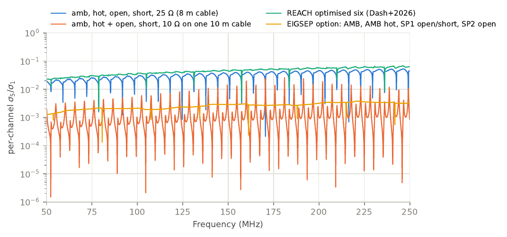
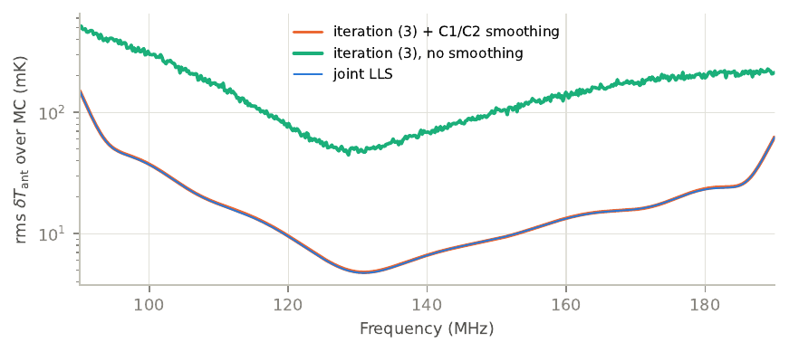
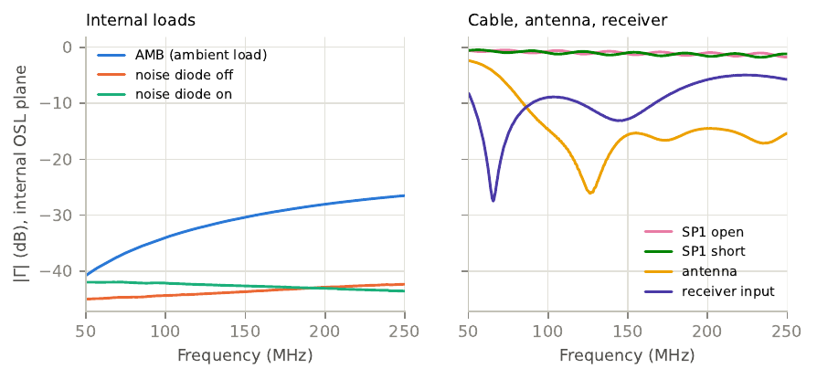
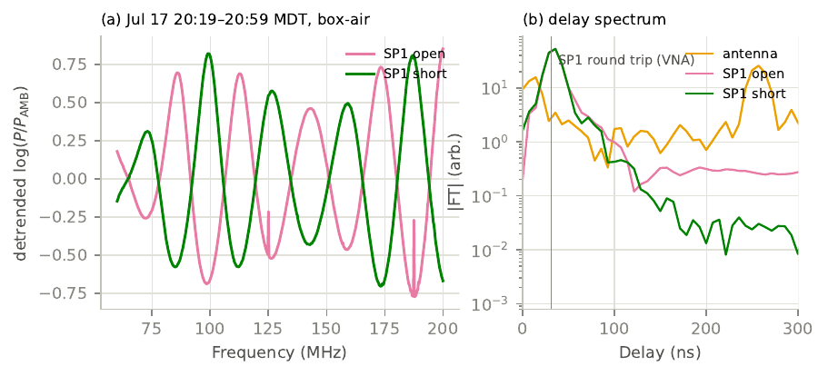

# EIGSEP D5 Memo M003: Receiver calibration — the equations to solve, their inputs, and what deployment 5 can support

> Generated from `memos/M003_receiver_calibration/memo.tex` at manuscript commit `5b9a8fa` of the EIGSEP Deployment 5 analysis by `scripts/memo2md.py`. Do not edit by hand: change the LaTeX source and regenerate.

## Abstract

Status: draft.

This memo reduces the receiver-calibration literature to one linear equation per switch state. The sources are Rogers & Bowman (2012), Monsalve et al. (2017, 2024), the REACH papers, and Bucher et al. (2026). For each input it states where EIGSEP measures it and whether Deployment 5 has it. Four points are settled, each backed by notebook `003_receiver_cal_formalism`.

*Bucher et al. (2026).* Their two-port noise treatment and the Rogers & Bowman equation are an exact reparameterisation of each other, agreeing to $4\times10^{-12}$ K. The map between them depends only on $\Gamma_{\mathrm{rx}}$, and their printed map drops a factor 2. The two forms differ only if $\Gamma_{\mathrm{rx}}$ changes while the amplifier’s intrinsic noise waves stay fixed.

*Monsalve et al. (2017).* Without noise, the iterative $C_1$/$C_2$ scheme reaches the joint least-squares solution of the same linear system. With noise it is a slightly different estimator of comparable accuracy: 28.1 vs 28.0 mK rms in an EDGES-like Monte Carlo. It is not a source of error, but it is rigid, so we solve the system directly.

*Solvability.* Per channel, the five parameters need at least four non-concyclic reflection coefficients and a temperature contrast. With every calibrator at one temperature the rank is at most 4, however many impedances are used. This is the zero-contrast limit of the REACH hot-load and $X_\mathrm{NS}$–$X_\mathrm{L}$ findings. Alignments of cable-terminated calibrators on the $\Gamma$-plane explain the degeneracy spikes.

*Deployment 5.* Every calibrator spectrum was taken at ambient temperature. The load thermistor read 37–47 $^\circ$C on Jul 12–13, probably without active heating (the controller shows zero drive), but no load-like receiver spectra were recorded while it was that warm, so the absolute noise-source scale cannot be solved in situ. A four-parameter fit using the ambient load and the SP1 open/short cable, with $T_{\mathrm{NS}}$ from a prior, is well conditioned with the measured reflections ($\kappa\approx47$). That is Rogers & Bowman-level calibration. However, field cable spectra exist only for $\approx2$ min per termination, on the evening of Jul 17 (notebook `006`). The LNAs and switches survived the fall, so a post-deployment lab calibration can supply the noise-source scale and the noise-wave parameters. The switch-path de-embedding uses the located lab S-parameters.

## 1. Question and scope

Which equations convert the measured autocorrelation $P_{\mathrm{ant}}$ of the suspended antenna into the antenna temperature $T_{\mathrm{ant}}$ at the receiver reference plane? What inputs do they need, and which of those did Deployment 5 record? This is the receiver half of the calibration model in the instrument paper (Bye et al. 2026, §4.1–4.2), $P_{\mathrm{ant}}=g_{\mathrm{rx}}(T_{\mathrm{ant}}+T_{\mathrm{rx}})$.

In scope:

- the measurement model and its gain-free (Dicke-ratio) form;

- the disagreement raised by Bucher et al. (2026);

- how to solve for the parameters, including the Monsalve et al. (2017) iteration versus direct least squares;

- the conditions a calibrator set must satisfy;

- the Deployment 5 inventory of inputs.

Out of scope:

- VNA calibration and the de-embedding that produces $\Gamma_s$ and $\Gamma_{\mathrm{rx}}$ (stage 2 of the roadmap);

- antenna, balun and beam efficiencies, $T_A=\eta T_S+(1-\eta)T_{\mathrm{phys}}$ (Monsalve et al. 2024);

- any fit to Deployment 5 spectra.

Numbers in Sections 4–6 come from synthetic tests whose parameters are listed in the notebook. They show structure (exactness, rank, convergence) and are not an EIGSEP error budget.

## 2. Sources and notation

The literature uses four parameterisations of the same physics. Table 1 maps them. Throughout, $\Gamma_s$ is the reflection coefficient of a source $s$ (antenna, calibrator or reference) and $\Gamma_r\equiv\Gamma_{\mathrm{rx}}$ is the receiver input reflection coefficient, both at a single reference plane $\mathcal{P}$ and referenced to 50 $\Omega$. All quantities depend on frequency.

```math
F_s \equiv \frac{\sqrt{1-|\Gamma_r|^2}}{1-\Gamma_s\Gamma_r},\qquad
M_s \equiv (1-|\Gamma_s|^2)\,|F_s|^2=\frac{(1-|\Gamma_s|^2)(1-|\Gamma_r|^2)}{|1-\Gamma_s\Gamma_r|^2}.\tag{F}
```

$M_s$ is the mismatch factor: delivered power over available power.

**Table 1.** Parameterisations of receiver noise and calibration constants in the sources.

| Reference                                  | Noise parameters                                         | Reference constants                                             | Solved by                                                              |
|:-------------------------------------------|:---------------------------------------------------------|:----------------------------------------------------------------|:-----------------------------------------------------------------------|
| Rogers & Bowman (2012), eq. 8              | $T_u,T_c,T_s,T_0$                                        | $T_{\mathrm{cal}}$, $T_{\mathrm{amb}}$ assumed known            | LS over frequency on an open or shorted cable                          |
| Monsalve et al. (2017), eq. 7              | $T_{\mathrm{unc}},T_{\mathrm{cos}},T_{\mathrm{sin}}$     | $C_1$, $C_2$ on assumed $T^a_{\mathrm{NS}}$, $T^a_{\mathrm{L}}$ | iteration (§6.4)                                                       |
| Monsalve et al. (2024), §3.2               | $T_U,T_C,T_S$                                            | $C_1,C_2$ inside $g_R,T_R$ with $K_0,K_U,K_C,K_S$               | iteration                                                              |
| Roque et al. (2021); Roque et al. (2025)   | $T_{\mathrm{unc}},T_{\mathrm{cos}},T_{\mathrm{sin}}$     | effective $T_{\mathrm{NS}}$, $T_{\mathrm{L}}$                   | conjugate-prior Bayes; per-channel LLS                                 |
| Dash et al. (2026); Dasgupta et al. (2026) | as Roque                                                 | as Roque                                                        | LLS with $\kappa(\mathbf X)$; Chebyshev basis, fixed $T_{\mathrm{NS}}$ |
| Bucher et al. (2026)                       | $T_R,T_L,T^B_{\mathrm{cos}},T^B_{\mathrm{sin}}$ and gain | none (absolute powers)                                          | $\ge5$ sources                                                         |

*Note.* $C_1T^a_{\mathrm{NS}}$ and $T^a_{\mathrm{L}}-C_2$ equal Roque’s $T_{\mathrm{NS}}$ and $T_{\mathrm{L}}$ (eq. C1C2). Bucher’s intrinsic parameters map onto the others through eq. (map).

## 3. Measurement model at one reference plane

For any switch state $s$ whose signal reaches the amplifier through $\mathcal{P}$, the power spectral density is

```math
P_s=g\Big[M_s T_s+|\Gamma_sF_s|^2\,T_{\mathrm{unc}}+\operatorname{Re}(\Gamma_sF_s)\,T_{\mathrm{cos}}+\operatorname{Im}(\Gamma_sF_s)\,T_{\mathrm{sin}}+T_0\Big].\tag{Ps}
```

This is Rogers & Bowman (2012) eq. 8 and Monsalve et al. (2017) eq. 2, since $|\Gamma_s||F_s|\cos\alpha=\operatorname{Re}(\Gamma_sF_s)$ with $\alpha=\arg(\Gamma_sF_s)$.

Here $g$ is the gain referenced to $\mathcal P$. $T_s$ is the available noise temperature of the source at $\mathcal P$. $T_0$ is the receiver noise delivered independently of the source. $(T_{\mathrm{unc}},T_{\mathrm{cos}},T_{\mathrm{sin}})$ describe receiver noise emitted toward the source that is reflected back, in parts uncorrelated and correlated with $T_0$.

The equation assumes:

1.  a linear receiver;

2.  $g$, $T_0$ and the noise parameters stable over one switching cycle;

3.  source noise uncorrelated with receiver noise;

4.  switch positions not in use perfectly isolated (the instrument paper reports $\ge90$ dB for the earlier SPDT switches; the 2026 multi-throw switch is not characterised here);

5.  $T_s$ including any lossy path between the physical source and $\mathcal P$.

For the last point, a termination at $T_t$ behind a path at $T_p$ has

```math
T_s=G\,T_t+(1-G)\,T_p,\qquad
G=\frac{|S_{21}|^2(1-|\Gamma_t|^2)}{|1-S_{11}\Gamma_t|^2(1-|\Gamma_s|^2)}\tag{availgain}
```

(Monsalve et al. 2017, eqs. 8–9). REACH applies the same relation to every cabled calibrator (Roque et al. 2025).

## 4. Reconciliation with Bucher et al. (2026)

### 4.1 The two-port description

Bucher et al. (2026) follow Penfield and Meys (1978). They represent the amplifier as a noiseless two-port preceded by input-referred travelling-wave jump sources: $A_R$ moves into the amplifier and $A_L$ moves toward the source. The spectra are $T_R=\langle|A_R|^2\rangle$ and $T_L=\langle|A_L|^2\rangle$, and the correlation is $c\equiv\langle A_R^*A_L\rangle=T^B_{\mathrm{cos}}-iT^B_{\mathrm{sin}}$. The absorbed power, expressed as a temperature, is

```math
T_{\mathrm{in}}=|F_s|^2\Big[(1-|\Gamma_s|^2)T_s+T_R+|\Gamma_s|^2T_L+2\operatorname{Re}(\Gamma_sc)\Big].\tag{bucher}
```

Bucher et al. transcribe R&B eq. 8 and mark two differences from their result: $T_0$ should read $|F_s|^2T_R$, and the correlated term should carry $|F_s|^2$ rather than $|F_s|$. In that transcription they take the phase as $\arg\Gamma_s$, whereas R&B define it as $\arg(\Gamma_aF)$. They conclude that eq. (Ps) is wrong because the marked differences depend on $\Gamma_s$.

### 4.2 Exact equivalence

Define the R&B waves as $B_L\equiv A_L+\Gamma_rA_R$, the total wave the receiver sends toward the source, and $B_R\equiv\sqrt{1-|\Gamma_r|^2}\,A_R$, the part of $A_R$ absorbed directly. The absorbed power is then exactly eq. (Ps) (Appendix A), with

```math
\begin{aligned}
T_0&=(1-|\Gamma_r|^2)\,T_R,\\
T_{\mathrm{unc}}&=T_L+|\Gamma_r|^2T_R+2\operatorname{Re}(\Gamma_rc^*),\\
T_{\mathrm{cos}}-i\,T_{\mathrm{sin}}&=2\sqrt{1-|\Gamma_r|^2}\,\big(c+\Gamma_rT_R\big).
\end{aligned}\tag{map}
```

The coefficients depend on $\Gamma_r$ only, never on $\Gamma_s$. For a given receiver, eqs. (Ps) and (bucher) are therefore the same model in different coordinates.

Bucher et al.’s statement that such a transformation “cannot be the case” is incorrect. Their closing paragraph concedes the equivalence when $\Gamma_r$ is fixed by in-situ calibration. In addition:

- Their printed version of eq. (map) omits the factor 2 in the $T_{\mathrm{unc}}$ cross term.

- Their transcription of R&B eq. 8 reads the phase as $\arg\Gamma_s$, whereas R&B define it as the phase of $\Gamma_aF$.

Notebook `003` (section A) checked this on 2000 random networks against a direct solution of the wave equations:

- eq. (bucher) agrees to $3.6\times10^{-12}$ K;

- eq. (Ps) with eq. (map) agrees to $3.2\times10^{-12}$ K;

- the printed map without the factor 2 is wrong by up to 258 K.

### 4.3 When the distinction matters

The two parameter sets transfer differently when $\Gamma_r$ differs between calibration and use.

1.  *Same receiver state* (in-situ calibration interleaved with sky data). Identical.

2.  *$\Gamma_r$ changes through the amplifier’s reverse transfer* (a different load on its output), with $A_R$ and $A_L$ fixed. Bucher’s parameters remain valid. R&B parameters must be re-mapped with eq. (map). In the notebook’s illustrative example, reusing stale R&B parameters after $|\Delta\Gamma_r|=0.002$, $0.005$ or $0.01$ gives 0.08, 0.20 or 0.39 K rms error in $T_{\mathrm{ant}}$.

3.  *$\Gamma_r$ changes because the LNA itself changed* (temperature, bias, ageing). Neither set is invariant; recalibrate or model the dependence.

In short, Bucher et al. are right that the intrinsic description is the physically invariant one. They are wrong that the standard equation is in error. EDGES lab calibrations carried to the field are exposed to cases (ii) and (iii); EIGSEP’s in-situ switching is case (i). Because eq. (map) is linear, one can also fit $(T_R,T_L,c)$ while evaluating the coefficients with the measured $\Gamma_{\mathrm{rx}}(t)$. This costs nothing and tests case (ii) against case (iii).

## 5. Removing the gain: the linear calibration equation

Take two internal references: $L$ (a load) and $N$ (noise source on). Form the switched ratio

```math
Q_s\equiv\frac{P_s-P_L}{P_N-P_L},\tag{Q}
```

which removes the time-variable gain. The references need not be matched, nor on the same switch port as the calibrators. Write $P_L=g_LD_L$ and $P_N=g_ND_N$, where $D$ is the bracket of eq. (Ps) for each reference on its own path. Substituting eq. (Ps) into eq. (Q) and dividing by $g(1-|\Gamma_r|^2)$ gives, for every source $s$ that shares the path through $\mathcal P$,

```math
T_s\frac{1-|\Gamma_s|^2}{|1-\Gamma_s\Gamma_r|^2}
+T_{\mathrm{unc}}\frac{|\Gamma_s|^2}{|1-\Gamma_s\Gamma_r|^2}
+T_{\mathrm{cos}}\frac{\operatorname{Re}\!\big[\Gamma_s/(1-\Gamma_s\Gamma_r)\big]}{\sqrt{1-|\Gamma_r|^2}}
+T_{\mathrm{sin}}\frac{\operatorname{Im}\!\big[\Gamma_s/(1-\Gamma_s\Gamma_r)\big]}{\sqrt{1-|\Gamma_r|^2}}
=Q_sT_{\mathrm{NS}}+T_{\mathrm{L}},\tag{cal}
```

with two source-independent constants

```math
T_{\mathrm{NS}}\equiv\frac{g_ND_N-g_LD_L}{g\,(1-|\Gamma_r|^2)},\qquad
T_{\mathrm{L}}\equiv\frac{(g_L/g)\,D_L-T_0}{1-|\Gamma_r|^2}.\tag{TNSTL}
```

Equation (cal) is exact under the assumptions of Section 3. It is linear in $\Theta=(T_{\mathrm{unc}},T_{\mathrm{cos}},T_{\mathrm{sin}},T_{\mathrm{NS}},T_{\mathrm{L}})$.

**What $C_1$ and $C_2$ are.** Monsalve’s left-hand side is $(T^*-T^a_L)C_1+T^a_L-C_2$ with $T^*=T^a_{\mathrm{NS}}Q+T^a_L$. It equals $Q\,C_1T^a_{\mathrm{NS}}+T^a_L-C_2$, so exactly

```math
T_{\mathrm{NS}}=C_1T^a_{\mathrm{NS}},\qquad T_{\mathrm{L}}=T^a_L-C_2 .\tag{C1C2}
```

$C_1$ and $C_2$ are not ad hoc corrections. By eq. (TNSTL) they are the two reference constants, and they absorb the references’ mismatch, path gains and the receiver offset. Roque et al. (2021) absorb them the same way, and MIST’s $(g_R,T_R)$ form is eq. (cal) solved for $T_A$ (Monsalve et al. 2024).

**Drifting reference temperatures.** $T_{\mathrm{NS}}$ and $T_{\mathrm{L}}$ contain the references’ physical temperatures through $D_L$ and $D_N$. In Deployment 5 the references are on different ports: $L$=RFAMB at $T_{\mathrm{amb}}$ (`tempctrl_load.T_now`) and $N$=RFNON, whose pad temperature is not measured directly. The three `rfswitch_therm` thermistors sit on the switch PCB (CHB; Q-CHB-10, resolved). Without temperature control, both constants should be modelled as linear in the logged temperatures, e.g. $T_{\mathrm{L}}(t)=T_{\mathrm{L}}^0+\kappa_L[T_{\mathrm{amb}}(t)-\bar T_{\mathrm{amb}}]$. The system stays linear.

Only gain changes common to all paths cancel in $Q_s$. The path-gain ratios $g_L/g$ and $g_N/g$ must therefore be stable.

A prior on $T_{\mathrm{NS}}$ is more than the diode’s ENR. By eq. (TNSTL), with $L$ and $N$ on separate ports it contains:

- the ENR and pad attenuation: **ENR 35 dB behind a 30 dB pad, a net 5 dB** (CHB, 2026-09-14; Q-CGT-05, resolved), so the on$-$off excess at the switch is $290\,\mathrm{K}\cdot10^{0.5}\simeq917$ K, independent of the pad temperature. This is a nameplate value, not a measurement, so the prior needs a width (**\[TODO: set it from a lab ENR measurement, IMP-05\]**);

- the pad temperature minus the ambient-load temperature;

- the RFNON vs RFAMB mismatch;

- the path-gain ratio $g_N/g_L$.

**Design-matrix form.** Multiplying eq. (cal) by $|1-\Gamma_s\Gamma_r|^2/(1-|\Gamma_s|^2)$ gives the Roque et al. (2021) form $T_s=\mathbf X_s\Theta$, with

```math
\begin{aligned}
X_{\mathrm L}&=\frac{|1-\Gamma_s\Gamma_r|^2}{1-|\Gamma_s|^2}, &
X_{\mathrm{NS}}&=Q_sX_{\mathrm L}, &
X_{\mathrm{unc}}&=-\frac{|\Gamma_s|^2}{1-|\Gamma_s|^2},\\
X_{\mathrm{cos}}&=-\frac{\operatorname{Re}[\Gamma_s(1-\Gamma_s^*\Gamma_r^*)]}{(1-|\Gamma_s|^2)\sqrt{1-|\Gamma_r|^2}}, &
X_{\mathrm{sin}}&=-\frac{\operatorname{Im}[\Gamma_s(1-\Gamma_s^*\Gamma_r^*)]}{(1-|\Gamma_s|^2)\sqrt{1-|\Gamma_r|^2}}. &&
\end{aligned}\tag{X}
```

A calibrator (known $T_s$) contributes a row. The antenna is solved from the same expression, $T_{\mathrm{ant}}=\mathbf X_{\mathrm{ant}}\hat\Theta$.

**Inputs of eq. (cal).** Per source and frequency:

- the PSDs $P_s,P_L,P_N$, close enough in time that the gain is common (interpolate $P_L$ and $P_N$ between reference visits);

- $\Gamma_s$ and $\Gamma_r$ at $\mathcal P$;

- for calibrators, $T_s$ at $\mathcal P$ (eq. availgain), i.e. physical temperatures plus path S-parameters.

No noise-source ENR is needed if the calibrator set itself determines $T_{\mathrm{NS}}$ (Section 6).

## 6. Solving the equations

### 6.1 Per-channel solvability: two conditions

Multiply a row of eq. (X) by $(1-|\Gamma_s|^2)$. The four impedance columns ($T_{\mathrm{unc}},T_{\mathrm{cos}},T_{\mathrm{sin}},T_{\mathrm{L}}$) become

```math
-|\Gamma_s|^2,\quad
-\frac{\operatorname{Re}\Gamma_s-|\Gamma_s|^2\operatorname{Re}\Gamma_r}{\sqrt{1-|\Gamma_r|^2}},\quad
-\frac{\operatorname{Im}\Gamma_s+|\Gamma_s|^2\operatorname{Im}\Gamma_r}{\sqrt{1-|\Gamma_r|^2}},\quad
1-2\operatorname{Re}(\Gamma_s\Gamma_r)+|\Gamma_s|^2|\Gamma_r|^2 ,
```

an invertible linear combination of $\{1,|\Gamma_s|^2,\operatorname{Re}\Gamma_s,\operatorname{Im}\Gamma_s\}$ for any $|\Gamma_r|<1$. Two statements follow for a single frequency.

1.  **Impedance (Möbius) condition.** The impedance block has rank 4 only if the calibrators’ $\Gamma_s$ do not all lie on one generalised circle $a+b|\Gamma_s|^2+c\operatorname{Re}\Gamma_s+d\operatorname{Im}\Gamma_s=0$ (Bucher et al. 2026). A calibrator made by terminating a cable is a Möbius transform of its termination. Terminations with real $\Gamma_t$ (open, short, resistors) on one cable are therefore concyclic. For a matched line they lie on a line through the origin, where a matched load also sits.

2.  **Temperature condition.** If all calibrators have the same temperature $T_{\mathrm{cal}}$, the left side of the multiplied row, $T_{\mathrm{cal}}(1-|\Gamma_s|^2)$, lies in the span of the impedance columns. The $X_{\mathrm{NS}}$ column is then exactly dependent, so the rank is $\le4$ for any number of impedances. The null direction is

    ```math
    \begin{gathered}
    (\delta T_{\mathrm{unc}},\delta T_{\mathrm{cos}},\delta T_{\mathrm{sin}},\delta T_{\mathrm{L}};\ \delta T_{\mathrm{NS}})\ \propto\ (\Theta_{\mathrm{imp}}-\boldsymbol\beta;\ T_{\mathrm{NS}}),\\
    \boldsymbol\beta=T_{\mathrm{cal}}\big(1-|\Gamma_r|^2,\ -2\sqrt{1-|\Gamma_r|^2}\,\operatorname{Re}\Gamma_r,\ 2\sqrt{1-|\Gamma_r|^2}\,\operatorname{Im}\Gamma_r,\ 1\big),
    \end{gathered}
    ```

    where $\Theta_{\mathrm{imp}}=(T_{\mathrm{unc}},T_{\mathrm{cos}},T_{\mathrm{sin}},T_{\mathrm{L}})$. More generally, $X_{\mathrm{NS}}$ is independent only if the vector $T_s(1-|\Gamma_s|^2)$ over calibrators lies outside the span of the impedance columns. With a single calibrator at a different temperature, this holds whenever the remaining isothermal calibrators alone have four non-concyclic $\Gamma_s$. The reflection of the warm calibrator itself does not matter.

The minimum per-channel set is therefore five sources: four isothermal calibrators with non-concyclic $\Gamma_s$, plus one at another temperature. This matches the counting of Bucher et al.

Statement 2 is the zero-contrast limit of two REACH results: the $X_{\mathrm{NS}}$–$X_{\mathrm L}$ near-degeneracy of Dasgupta et al. (2026), and the finding of Dash et al. (2026) that the hot load is indispensable. With a hot load present, the near-degeneracy is set by the contrast relative to $T_{\mathrm{NS}}$, e.g. a 370 K load against $T_{\mathrm{NS}}\approx1100$ K.

The EDGES set (ambient, hot, open and shorted cable) has four rows for five parameters and only three distinct impedances. It is rank 4 in every channel.

Where a cable-terminated calibrator must stay non-concyclic with a load on another port, the points align periodically. A real-axis load next to an open/short pair on a cable of two-way delay $\tau_2$ is collinear with it whenever $\nu\tau_2\in\mathbb Z/2$, so degeneracy dips recur every $1/(2\tau_2)$. For the notebook’s 8 m cable this predicts 6.56 MHz, and a local minimum lies within 0.06 MHz of every predicted dip (Fig. 1). The same mechanism plausibly produces the $\approx6.3$ MHz spikes that Dasgupta et al. (2026) mask, although their calibrator set has no bare real-axis load. Its 2 m-cable and 10 m-cable terminations lie on two lines through the (hot-load) origin, and these align every $1/(2\Delta\tau_2)$, where $\Delta\tau_2$ is the difference in round-trip delay between the cables. For ideal matched cables, a 6.3 MHz spacing implies a velocity factor $\approx0.67$ (solid-PE coax). Their cable type is not stated.



**Figure 1.** Per-channel reciprocal condition number $\sigma_5/\sigma_1$ of the column-equilibrated design matrix (eq. X) for four calibrator sets that are rank 5 (synthetic, 50–250 MHz, $|\Gamma_r|=0.1$). Four distinct impedances plus a hot load (blue) and the REACH optimised set (green) are well conditioned apart from periodic Möbius-alignment dips. Open, short and 10 $\Omega$ on one cable (orange) are nearly concyclic. The EIGSEP option of Section 8 (yellow) is rank 5. Two things limit it: the small 44 K contrast of its warm load, and its nearly collinear ambient points (AMB near the origin, on the SP1 open/short line). The warm load’s own reflection plays no role. Sets that are rank-deficient in every channel are not plotted: EDGES four; all-ambient five; Deployment 5 AMB + SP1 open/short.

### 6.2 Smooth frequency models

Monsalve et al. and Roque et al. model each parameter as a low-order series in frequency, $\Theta_k(\nu)=\sum_jc_{kj}\,\mathcal T_j(x)$. The stacked system can then be well conditioned even when every channel is rank-deficient: the cable phase rotates the per-channel null vector across the band, and a smooth model cannot follow it (Rogers & Bowman 2012, §4). Table 2 lists the notebook’s condition numbers (7-term Chebyshev series, 50–250 MHz).

The temperature condition is not rescued by smoothness. All-ambient sets stay singular at every cable length ($\kappa\gtrsim10^{10}$).

**Table 2.** Condition number of the stacked, column-equilibrated system versus the calibration cable’s two-way delay (synthetic).

| $\tau_2$ (ns) | EDGES four, 5 par. | AMB+SP1 O/S, 5 par. | AMB+SP1 O/S, $T_{\mathrm{NS}}$ fixed | AMB+SP1 open, $T_{\mathrm{NS}}$ fixed |
|:--------------|:-------------------|:--------------------|:-------------------------------------|:--------------------------------------|
| 3             | $6.1\times10^{6}$  | $7.4\times10^{12}$  | $3.2\times10^{6}$                    | $5.1\times10^{14}$                    |
| 10            | $6.8\times10^{2}$  | $3.7\times10^{11}$  | $5.2\times10^{2}$                    | $3.8\times10^{9}$                     |
| 20            | $3.0\times10^{2}$  | $8.3\times10^{10}$  | 73                                   | $6.0\times10^{4}$                     |
| 31            | $1.9\times10^{2}$  | $3.5\times10^{10}$  | 49                                   | 44                                    |
| 95            | 59                 | $2.2\times10^{10}$  | 21                                   | 15                                    |
| 190           | 30                 | $1.5\times10^{10}$  | 15                                   | 12                                    |

*Note.* 31 ns is the SP1 round-trip delay measured at the internal VNA plane (Section 7).

### 6.3 Estimator

Stack eq. (X) over calibrators, channels and (optionally) epochs as $\mathbf y=\mathbf A\mathbf c+\mathbf n$. Solve by generalised least squares, with an optional Gaussian prior:

```math
\hat{\mathbf c}=(\mathbf A^{\mathsf T}\mathbf N^{-1}\mathbf A+\mathbf V_0^{-1})^{-1}(\mathbf A^{\mathsf T}\mathbf N^{-1}\mathbf y+\mathbf V_0^{-1}\boldsymbol\mu_0),\qquad
\mathrm{Cov}(\hat{\mathbf c})=(\mathbf A^{\mathsf T}\mathbf N^{-1}\mathbf A+\mathbf V_0^{-1})^{-1}.\tag{gls}
```

With $\mathbf V_0^{-1}=0$ this is the joint least-squares solution. With conjugate priors it is the posterior mean of Roque et al. (2021).

Practical rules, following Dasgupta et al. (2026) and Dash et al. (2026):

1.  Use a Chebyshev basis on the normalised band, not monomials.

2.  Solve the whitened system by QR or SVD rather than inverting normal matrices.

3.  Report $\kappa$ per channel and for the stack, and mask channels at alignment dips.

4.  Choose model orders by evidence or with a held-out calibrator.

5.  Fix $T_{\mathrm{NS}}$, or give it a prior, when the set has no temperature contrast.

Thermal noise sits in $Q_s$, i.e. in the regressor $X_{\mathrm{NS}}$ (errors-in-variables). Its first-order effect is an extra residual variance $(T_{\mathrm{NS}}X_{\mathrm L}\sigma_Q)^2$, and the attenuation bias is second order in $\sigma_Q/Q$.

### 6.4 The Monsalve et al. (2017) iteration

Monsalve’s scheme is as follows. Update $C_1$ and $C_2$ per channel so that the ambient and hot loads calibrate to their temperatures. Fit $T_{\mathrm{unc}}$, $T_{\mathrm{cos}}$ and $T_{\mathrm{sin}}$ as polynomials to the two cables with $C_{1,2}$ held fixed. Repeat (M17 report convergence after three iterations), then smooth $C_{1,2}$ with polynomials. Because eq. (cal) is linear, this is a block fixed-point iteration for the same equations that eq. (gls) solves in one step. Notebook `003` (section C) compares the two in an EDGES high-band-like setup (Fig. 2).

- *Noiseless.* Both reach the true parameters, to $\lesssim10^{-10}$ K in $T_{\mathrm{ant}}$ (the iteration after enough steps). After three iterations the residual grows with load mismatch: $3\times10^{-7}$ K for $|\Gamma_{A,H}|=0.005$, 2.6 mK for 0.1, and 0.19 K for 0.4.

- *With noise* (per-channel noise on $T^*$ as in M17 Table 1, 400 realisations). Joint LLS gives 28.0 mK rms in $T_{\mathrm{ant}}$ and the iteration 28.1 mK. After a five-term log-polynomial foreground fit the median residuals are 10.8 mK for both. Without the final $C_{1,2}$ smoothing the iteration gives 191 mK. The iteration’s fixed point is a different estimator from weighted joint LLS: it matches the two loads exactly in every channel and fits the cables unweighted. The two agree in accuracy but not realisation by realisation.

The recursion therefore introduces no significant error in the EDGES configuration. Its problems are structural:

- calibrator roles are hard-wired (two matched loads for $C_{1,2}$, cables for the noise waves), so it cannot use more sources, validators or priors;

- a stopping point that suits well-matched loads can leave it unconverged for poorly matched ones;

- its smoothing sits outside the fit;

- it returns no covariance.

Direct (G)LS gives the same answer where the iteration works and is strictly more general. We adopt it.



**Figure 2.** RMS calibration error in $T_{\mathrm{ant}}$ over 400 noise realisations (synthetic, EDGES high-band-like). The joint least-squares solve (thin blue) lies on top of the Monsalve et al. (2017) iteration with its final $C_1/C_2$ smoothing (wide orange). Green: the iteration without smoothing.

## 7. Inputs and the deployment-5 inventory

Through 2025 the EIGSEP front end used a MIST-style network of SPDT switches. In July 2026 it uses a single multi-throw switch for all paths; the only SPDT sets the termination at the end of the SP1 cable (CHB, logbook 2026-09-13). Like EDGES-3 and REACH, it has in-situ calibrators, and it sits behind the suspended antenna only. Its receiver-side switch positions are:

- RFANT (sky);

- RFAMB (a 50 $\Omega$ load that `tempctrl_load` can heat);

- RFNON/RFNOFF (noise diode on/off behind a pad);

- RFSP1 (a 3 m coax ending in an open/short switch; length from CHB, 2026-09-14. Its 31 ns measured round trip implies a velocity factor of 0.65–0.69, i.e. a solid dielectric; the type itself is still unknown (Q-CHB-33), and the cable temperature was not logged);

- RFSP2 (unused).

The VNA measures the reflection of each (`ants11`: `ant, amb, load, noise, sp1_open, sp1_short`) and of the receiver input (`recs11`: `rec`), after an internal OSL.

Notebook `003` (section D), with `001`, gives the following:

- *Schedule.* 32 of 40 S11 files, including all 28 measured in night 16/17, embed `RFANT:600 RFNON:60 RFAMB:60` (seconds): no RFNOFF and no SP1 dwell. The earlier files (Jul 9–13) embed `RFANT:3600` plus RFNOFF and RFSP1.

- *Load temperature control.* `tempctrl_load` is disabled in all night-16/17 files, with $T_{\mathrm{now}}=24.9$–$28.5\,^\circ$C. The S11 configuration embeds it as enabled with a 35 $^\circ$C target in four files from Jul 13, but the controller’s own telemetry in the correlator files reads disabled with zero drive, on Jul 12–13 as well (spot check, logbook 2026-09-13). The load was probably not actively heated; for calibration its temperature reading is what counts (CHB; Q-CHB-26). That day was in the field, with significant RFI and people nearby (CHB; Q-CHB-11).

- *Warm load on Jul 12–13* (notebook `006`, §4).

  - The load thermistor reads 37–47 $^\circ$C from Jul 12 20:00 to Jul 13 20:00 MDT, against 25–30 $^\circ$C on Jul 15–17.

  - No receiver spectrum recorded while the load was that hot looks like a load. In phase A (key 3), the only rows whose shape matches the ambient-load template (213 rows) belong to the labelled Jul 13 10:22 visit (AMB, NOFF, NON), at a load temperature of 31 $^\circ$C. The hot hours are antenna-like or RFI-structured.

  - The field data therefore hold no hot-load calibrator. The load was never switched to the receiver by hand (CHB; Q-CHB-18).

- *Hours per state, phase C:* RFANT 44.0 h (plus 24.5 h `MISSING`; notebook `002` finds that 64% of the live `MISSING` rows in phase C look like antenna), RFAMB 1.32 h, RFNON 1.13 h, RFNOFF 0.01 h, RFSP1 0.17 h.

- *SP1 cable spectra in the field* (notebook `006`, Fig. 4; box-air, 60–200 MHz).

  - **Jul 17, 20:19–20:59 MDT: usable.** Open 119 s (4 visits) and short 118 s (4 visits). They are the terminated cable:

    - $P/P_{\mathrm{AMB}}=0.48$ (open) and 0.55 (short);

    - the detrended $\log(P/P_{\mathrm{AMB}})$ ripple peaks in the 36 ns delay bin, next to the 31 ns VNA round trip;

    - the open and short ripples are anti-correlated ($r=-0.985$) and uncorrelated with the antenna ($r=-0.005$);

    - no 1 MHz comb, and NON/AMB is stable to 1.7%;

    - per-channel noise of the median spectrum is $\approx0.25\%$ at 244 kHz.

  - **Jul 15, 19:14–20:47 MDT: not usable.** The 1 MHz comb dominates, the RFNON reference is unstable (62% spread), open was on for only 17 s, and the open/short anti-correlation is weak ($r=-0.39$).

  - **Jul 13** (phase A, key 3, warm-load day with heavy RFI): short termination only, 460 s in 16 visits; not analysed further here.

- *Reflections* (Fig. 3; ideal OSL at the internal plane, no path de-embedding, pair measured Jul 16 22:02 MDT).

  - AMB: median $-30.3$ dB.

  - Noise diode off/on: $-44.0/-43.5$ dB.

  - SP1 open and short: $-1.0/-1.1$ dB with a 31 ns round-trip group delay and $\Gamma_{\mathrm{open}}\approx-\Gamma_{\mathrm{short}}$ (to 0.10). A genuine open/short pair.

  - Antenna: median $-15.5$ dB.

  - Receiver input: $-9.4$ dB, stable across the night. This is a poor match that amplifies every noise-wave term.

- *S11 quality.* For 7 of the 14 night `ants11` files the ideal-OSL solve is singular in at least one channel. The cause is the `cmt_vna` cold-start trigger bug (issue \#54), which zero-fills the sweeps at session start (Q-CGT-09, resolved). Notebook `013` therefore borrows a usable internal OSL for 66 of 127 epochs; only 7 of 20 antenna-mode files have their own.



**Figure 3.** Deployment 5 reflection coefficients of every switch position for one night-16/17 pair (`ants11`/`recs11_20260717_190839Z`), calibrated with ideal OSL at the VNA’s internal plane. The switch paths are not de-embedded.



**Figure 4.** Field SP1 cable spectra, Jul 17 20:19–20:59 MDT (box-air). (a) Detrended $\log(P/P_{\mathrm{AMB}})$ for the open and shorted cable: the ripples are in anti-phase. (b) Delay spectra, with the SP1 round trip from the VNA marked. The antenna’s delay structure (yellow) is unrelated.

**Table 3.** Inputs to eq. (cal): where EIGSEP measures them, their Deployment 5 status, and bridges.

| Input                              | EIGSEP source                                                        | Deployment 5 status                                                                                                                     | Bridge if missing                                                                                                                                                                                            |
|:-----------------------------------|:---------------------------------------------------------------------|:----------------------------------------------------------------------------------------------------------------------------------------|:-------------------------------------------------------------------------------------------------------------------------------------------------------------------------------------------------------------|
| $P_{\mathrm{ant}}$                 | RFANT, key 4 (phase C)                                               | 44 h, plus `MISSING` rows that look like antenna                                                                                        | —                                                                                                                                                                                                            |
| $P_L$, $P_N$                       | RFAMB, RFNON                                                         | 1.3 h and 1.1 h; 60 s visits every $\sim$<!-- -->12 min in night 16/17                                                                  | gain interpolation between visits                                                                                                                                                                            |
| $P_s$ with known $T_s$             | RFSP1 open/short; RFNOFF                                             | SP1 open and short $\approx2$ min each on Jul 17 20:19–20:59 MDT (usable; nb. 006); Jul 15 comb-contaminated; NOFF 18 s on Jul 15       | post-deployment lab calibration (LNAs and switches survived)                                                                                                                                                 |
| Temperature contrast               | RFAMB heated via `tempctrl_load`                                     | load read 37–47 $^\circ$C on Jul 12–13 (controller drive zero; Q-CHB-26), but no load-like spectra while warm (nb. 006 §4; Q-CHB-18)    | post-deployment lab hot/cold loads; $T_{\mathrm{NS}}$ prior (ENR, pad, $T_{\mathrm{pad}}-T_{\mathrm{amb}}$, NON/AMB mismatch, path-gain ratio; eq. TNSTL); sky-model scale (degenerate with beam and ground) |
| $\Gamma_s$, $\Gamma_{\mathrm{rx}}$ | VNA after internal OSL                                               | 14 hourly pairs in night 16/17, sparse otherwise (Q-CHB-32); 7 with singular OSL solve (`cmt_vna` \#54)                                 | stage 2 (notebook `013`, with borrowed OSLs)                                                                                                                                                                 |
| Path S-parameters to $\mathcal P$  | lab file `switch_sparams.npz` (7 switch paths)                       | final (Q-CGT-02); measured after the fall with the instrument disassembled, each path at its port’s connector face (Q-CGT-03, Q-CGT-11) | fitted path delays and losses if unusable                                                                                                                                                                    |
| Physical temperatures              | `tempctrl_load.T_now`; `rfswitch_therm` (switch PCB); SP1 cable; LNA | load OK; switch-PCB readings need cleaning; SP1 cable temperature not logged and type unknown (Q-CHB-33); `tempctrl_lna` dead           | switch-PCB temperature as a proxy for the in-box paths                                                                                                                                                       |
| Receiver stability                 | no LNA temperature control in Deployment 5                           | $\Gamma_{\mathrm{rx}}$ measured hourly only on night 16/17 (Q-CHB-32)                                                                   | fit per epoch; intrinsic parameterisation (Section 4)                                                                                                                                                        |

### 7.1 What Deployment 5 can support

1.  **Relative calibration (available now).** $T^*=T^a_{\mathrm{NS}}Q+T^a_L$ from RFAMB/RFNON (Monsalve et al. 2017, eq. 1). This removes gain variations. It leaves the unknown $T_{\mathrm{NS}}$ scale, the $T_{\mathrm{L}}$ offset and all mismatch terms.

2.  **Four-parameter noise-wave fit (reachable).** Fix $T_{\mathrm{NS}}$ to a prior and fit smooth $T_{\mathrm{unc}},T_{\mathrm{cos}},T_{\mathrm{sin}},T_{\mathrm{L}}$ to AMB and the SP1 open/short cable. With the measured internal-plane reflections the stacked condition number is 47, or 59 with the open cable only.

    Field SP1 spectra exist only for $\approx2$ min per termination on Jul 17 evening (notebook `006`), so the fit applies to that epoch. Carrying it to night 16/17 assumes a stable receiver, which must be checked with the AMB/NON Y-factor and the hourly $\Gamma_{\mathrm{rx}}$. This is the calibration of Rogers & Bowman (2012), and it requires stage-2 reflections at $\mathcal P$. Suppose $T_{\mathrm{NS}}$ is wrong by a factor $1+\epsilon$ and the other four parameters are refitted to calibrators at a common temperature $T_{\mathrm{cal}}$. The refit absorbs the error along the null direction of Section 6.1, and the antenna temperature shifts by exactly $\delta T_{\mathrm{ant}}=\epsilon\,(T_{\mathrm{ant}}-T_{\mathrm{cal}})$. This is a scale error about $T_{\mathrm{cal}}$, smooth if $\epsilon(\nu)$ is. Smooth frequency models leave a small extra residual, because $\boldsymbol\beta$ depends on $\Gamma_r$.

    The calibrators are only approximately isothermal. AMB sits at 24.9–28.5 $^\circ$C and the SP1 cable temperature is not logged. Their difference is a weak, drifting contrast that is degenerate with receiver drift, since the LNA has no temperature control. It should not be used to fit $T_{\mathrm{NS}}$.

3.  **Absolute five-parameter calibration (not possible from Deployment 5 field data alone).** By Section 6.1 it needs a calibrator at a second temperature. With measured reflections the all-ambient five-parameter stack gives $\kappa=3.5\times10^3$ rather than a singular matrix, but only because the smooth basis cannot absorb $\Gamma_{\mathrm{rx}}$ ripple; that is not information. A load heated to 340 K would give $3.3\times10^2$.

    The LNAs and switches survived the fall (CHB; Q-CHB-09, resolved). A post-deployment lab calibration of the same receiver, with external hot and cold loads and cables, can therefore supply $T_{\mathrm{NS}}$ and the noise-wave parameters, as in Monsalve et al. (2017) and Monsalve et al. (2024). The result transfers to the field under case (iii) of Section 4, with the field AMB, NON and SP1 data as the check.

    The coax from the antenna balun to the switch did not survive, so its S-parameters cannot be measured. It is on the antenna side of $\mathcal P$. The S11 chain and the in-situ calibration de-embed only switch paths, so for both of them the antenna source is the antenna, balun and coax together. The coax enters $\Gamma_s$ for the antenna and the efficiency correction, not the receiver calibration. The beam models are free space and include neither the balun nor the coax (CHB), so the calibrated $T_{\mathrm{ant}}$ is not at the plane of a simulated antenna temperature. Calibration needs no coax model. Comparisons with simulations do, with priors on the coax loss and temperature.

## 8. Decisions and implications

1.  Solve eq. (cal) directly by (G)LS (eq. gls) with a Chebyshev basis and $\kappa$ monitoring. Report $C_1,C_2$ through eq. (C1C2) only for comparison with EDGES and MIST. Implement it in `code/src` with tests, and propose it to `eigsep_cal` if generally useful.

2.  Keep the standard noise-wave form. Run the intrinsic (Bucher) parameterisation, with coefficients from the measured $\Gamma_{\mathrm{rx}}(t)$, as a variant and compare the two fits.

3.  Take $\mathcal P$ as the common LNA-side node of the switch network. Every state’s path is part of its source ($\Gamma_s$ by embedding, $T_s$ by eq. availgain). This makes the lab switch-path S-parameters a hard requirement for stage 2.

4.  For Deployment 5:

    - fit tier 2 on the Jul 17 evening SP1/AMB/NON data with an explicit $T_{\mathrm{NS}}$ prior;

    - plan a post-deployment lab calibration of the surviving receiver as the absolute reference (tier 3);

    - validate each on held-out data (one SP1 termination) and against the sky model.

5.  For the next deployment, in order of leverage:

    - schedule a heated RFAMB (the hardware can; it gives the temperature contrast);

    - keep SP1 open and short in the schedule;

    - use SP2 for a second cable of different length, or a reactive termination (a fourth non-concyclic impedance);

    - log the SP1 cable and LNA temperatures;

    - measure the switch paths and the noise-source ENR in the lab beforehand;

    - improve $|\Gamma_{\mathrm{rx}}|$.

    With a heated AMB, SP1 open/short and an SP2 open cable the set is rank 5 in every channel (Fig. 1, yellow).

## 9. Open issues

- **\[CHB: SP1 cable type, for its thermal coefficients of delay and loss. The length (3 m) is known, and the temperature was not logged (Q-CHB-33, was Q-CGT-06).\]**

- **\[TODO: Fold in notebook `014` (stage-3 preparation). With the measured $|\Gamma_{\mathrm{rx}}|=0.326$, a lab hot load gives $\kappa=91.5$, 72.1 and 45.9 at 373, 400 and 500 K, and a 1 K hot-load error costs 9.2 K rms on a 1500 K antenna at 400 K (`docs/lab_calibration_plan.md` §1–2). On night 16/17, interpolating the reference across $\pm 12$ min leaves 0.26% rms in gain.\]**

- **\[TODO: $T_{\mathrm{NS}}$ is not constant over a night. On night 16/17 $Y=P_{\mathrm{NON}}/P_{\mathrm{AMB}}$ rises 0.47%/h, driven by $P_{\mathrm{NON}}$ and not tracked by temperature, so the fits need a smooth-in-time $T_{\mathrm{NS}}$ between changepoints (notebook `014`; Q-CHB-35). The Jul 17 SP1 epoch is not the night state ($Y$ is 0.898 of the night value), so the first tier-2 fit there needs its own $T_{\mathrm{NS}}$ and gain.\]**

## A. Derivation of the parameter map

This appendix derives eq. (map). Label the waves between the source and the noise block $r_1$ (toward the amplifier) and $l_1$, and those between the noise block and the amplifier $r_2$ and $l_2$. The network equations are:

- source: $r_1=\Gamma_sl_1+\sqrt{1-|\Gamma_s|^2}A_S$;

- jump conditions: $r_2=r_1+A_R$ and $l_1=l_2+A_L$;

- amplifier: $l_2=\Gamma_rr_2$.

Eliminating gives $r_2(1-\Gamma_s\Gamma_r)=A_R+\Gamma_sA_L+\sqrt{1-|\Gamma_s|^2}A_S$, and the absorbed power is $(1-|\Gamma_r|^2)\langle|r_2|^2\rangle$. Expanding this with $\langle|A_S|^2\rangle=T_s$ yields eq. (bucher).

Substituting $A_L=B_L-\Gamma_rA_R$ gives $r_2=A_R+(\Gamma_sB_L+\sqrt{1-|\Gamma_s|^2}A_S)/(1-\Gamma_s\Gamma_r)$. Multiplying by $\sqrt{1-|\Gamma_r|^2}$ gives $B_R+F_s(\Gamma_sB_L+\sqrt{1-|\Gamma_s|^2}A_S)$. Its mean square is

```math
\langle|B_R|^2\rangle+|F_s|^2|\Gamma_s|^2\langle|B_L|^2\rangle+M_sT_s+\operatorname{Re}\!\big[\Gamma_sF_s\,2\langle B_R^*B_L\rangle\big].
```

With $T_0=\langle|B_R|^2\rangle$, $T_{\mathrm{unc}}=\langle|B_L|^2\rangle$ and $T_{\mathrm{cos}}-iT_{\mathrm{sin}}=2\langle B_R^*B_L\rangle$ this is eq. (Ps). Evaluating the three moments with $\langle A_R^*A_L\rangle=c$ gives eq. (map).

## B. Provenance

**Table 4.** Notebooks and products behind this memo.

| Notebook / script                      | Commit    | Products                               |
|:---------------------------------------|:----------|:---------------------------------------|
| `003_receiver_cal_formalism.ipynb`     | `81e7488` | `products/003_receiver_cal_formalism/` |
| `001_inventory.ipynb`                  | `6d59cd1` | `products/001_inventory/`              |
| `002_row_stats.ipynb` (`MISSING` rows) | `6d59cd1` | `products/002_row_stats/`              |
| `006_sp1_field_spectra.ipynb`          | `4131e59` | `products/006_sp1_field_spectra/`      |

*Note.* Literature sources are in `literature/receiver_calibration/`; the register is `literature/README.md`.

## References

- Bucher, M., Kirkham, C. J., de Lera Acedo, E., et al. 2026, Global 21cm Measurement Calibration Methodology, [arXiv:2607.26741](https://arxiv.org/abs/2607.26741)
- Bye, C. H., DeBoer, D. R., Dexter, M., et al. 2026, The electromagnetically isolated global signal estimation platform (EIGSEP), [arXiv:2602.02661](https://arxiv.org/abs/2602.02661)
- Dasgupta, S., Dash, A. K., Anstey, D., et al. 2026, Impact of numerical stability in Bayesian noise wave calibration on global 21-cm experiments, [arXiv:2607.26911](https://arxiv.org/abs/2607.26911)
- Dash, A. K., Anstey, D., Bevins, H. T. J., et al. 2026, Optimisation of calibration sources for global 21-cm experiments: the REACH case, [arXiv:2604.00105](https://arxiv.org/abs/2604.00105)
- Meys, R. P. 1978, A Wave Approach to the Noise Properties of Linear Microwave Devices, IEEE Transactions on Microwave Theory and Techniques, 26, 34–37, [doi:10.1109/TMTT.1978.1129303](https://doi.org/10.1109/TMTT.1978.1129303)
- Monsalve, R. A., Rogers, A. E. E., Bowman, J. D., et al. 2017, Calibration of the EDGES High-band Receiver to Observe the Global 21 cm Signature from the Epoch of Reionization, ApJ, 835, 49, [doi:10.3847/1538-4357/835/1/49](https://doi.org/10.3847/1538-4357/835/1/49)
- Monsalve, R. A., Altamirano, C., Bidula, V., et al. 2024, Mapper of the IGM spin temperature: instrument overview, MNRAS, 530, 4125–4147, [doi:10.1093/mnras/stae1138](https://doi.org/10.1093/mnras/stae1138)
- Rogers, A. E. E., & Bowman, J. D. 2012, Absolute calibration of a wideband antenna and spectrometer for accurate sky noise temperature measurements, Radio Science, 47, RS0K06, [doi:10.1029/2011RS004962](https://doi.org/10.1029/2011RS004962)
- Roque, I. L. V., Handley, W. J., & Razavi-Ghods, N. 2021, Bayesian noise wave calibration for 21-cm global experiments, MNRAS, 505, 2638–2646, [doi:10.1093/mnras/stab1453](https://doi.org/10.1093/mnras/stab1453)
- Roque, I. L. V., Razavi-Ghods, N., Carey, S. H., et al. 2025, Receiver design for the REACH global 21-cm signal experiment, Experimental Astronomy, 59, 7, [doi:10.1007/s10686-024-09975-3](https://doi.org/10.1007/s10686-024-09975-3)
